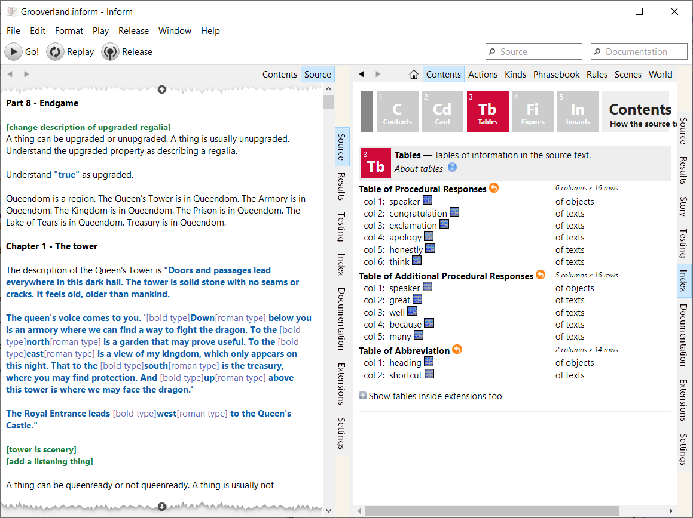

# Windows Inform 7

[Inform 7](http://inform7.com/) is the most widely used interactive fiction (i.e. text adventure game) authoring system available today. This repository contains the Windows front-end that represents the user interface that users of Inform work with:



## Building

Download and install Visual Studio 2019 Community edition from https://visualstudio.microsoft.com/. In the installer, under "Workloads", make sure that "Desktop development with C++" is selected. In the list on the right-hand side make sure that the following are selected:
- Windows 11 SDK
- C++ Clang tools for Windows
- C++ Clang Compiler for Windows
- C++ MFC for latest build tools

Install git. I use the version of git that is part of MSYS2, a Linux-like environment for Windows, but Git for Windows can be used from a Windows command prompt.

Open the environment that you are using git from, and switch to the root directory that the build environment will be created under (from here referred to as "\<root>"). Clone this and the other required repositories with git:
```
git clone https://github.com/DavidKinder/Windows-Inform7.git Adv/Inform7
git clone https://github.com/DavidKinder/inform.git Adv/Inform7/Distribution/inform
git clone https://github.com/DavidKinder/Windows-Frotz.git Adv/Frotz
git clone https://github.com/DavidKinder/Git.git Adv/Git
git clone https://github.com/DavidKinder/Windows-Glk.git Adv/Glk
git clone https://github.com/DavidKinder/Glulxe.git Adv/Glulxe/Generic
git clone https://github.com/DavidKinder/Libraries.git Libraries
```

Download and install the latest release of Windows Inform 7 from https://github.com/DavidKinder/Windows-Inform7/releases/ and copy everything in the installation directory to "\<root>/Adv/Inform7/Build", but do not over-write any existing files.

### Third-party libraries

#### libpng

Download the latest version of zlib from https://zlib.net/. Unpack the archive and copy the contents of the top-level directory to "\<root>/Libraries/zlib".

Download the latest version of libpng from http://www.libpng.org/pub/png/libpng.html. Unpack the archive and copy the contents of the top-level directory to "\<root>/Libraries/libpng". Copy the file "\<root>/Libraries/libpng/scripts/pnglibconf.h.prebuilt" to "\<root>/Libraries/libpng/pnglibconf.h".

Open "\<root>/Libraries/libpng/pnglibconf.h" in a text editor, and find and delete all lines that define symbols starting with "PNG_SAVE_", "PNG_SIMPLIFIED_WRITE_" and "PNG_WRITE_".

#### libjpeg

Download libjpeg 6b from http://libjpeg.sourceforge.net/. (Later versions are available, but maintenance of libjpeg seems to have been taken up by someone other than the original authors, who has some distinctly odd ideas.)

Unpack the archive and copy the contents of the "jpeg-6b" directory to "\<root>/Libraries/jpeg". In "\<root>/Libraries/jpeg", rename "jconfig.vc" to "jconfig.h".

Open "\<root>/Libraries/jpeg/jmorecfg.h" in a text editor, and find
```
#ifndef XMD_H			/* X11/xmd.h correctly defines INT32 */
typedef long INT32;
#endif
```
Change it to
```
#if !defined(XMD_H) && !defined(_BASETSD_H_)
typedef long INT32;
#endif
```
In the same file, find
```
#ifdef NEED_FAR_POINTERS
#define FAR  far
#else
#define FAR
#endif
```
Change it to
```
#ifndef FAR
#ifdef NEED_FAR_POINTERS
#define FAR  far
#else
#define FAR
#endif
#endif
```

#### libvorbis

Download the latest stable versions of libogg and libvorbis from https://xiph.org/downloads/. Unpack the libogg archive and copy the contents of the top-level directory to "\<root>/Libraries/libogg". Unpack the libvorbis archive and copy the contents of the top-level directory to "\<root>/Libraries/libvorbis".

#### hunspell

Download the latest release of hunspell from https://github.com/hunspell/hunspell/releases/. Unpack the archive and copy the contents of the "src/hunspell" directory to "\<root>/Libraries/hunspell".

#### Chromium Embedded Framework

Download version 127.3.4 of the minimal distribution for Windows 64-bit from https://cef-builds.spotifycdn.com/index.html.
Unpack the archive and copy the contents of it to "\<root>/Libraries/libcef".
It should also be possible to use the latest stable build of CEF for Windows 64-bit, but the CEF project tends to change its header files fairly frequently, so you will probably need to adjust the project file to make the latest stable build of CEF work.

#### JSON for Modern C++

Download the latest release of JSON for Modern C++ from https://github.com/nlohmann/json/releases/. The file required is "include.zip". Unpack the archive and copy the contents of it to "\<root>/Libraries/json".

### Compiling the projects

Start Visual Studio, open the solution "\<root>/Adv/Inform7/Inform7/Inform7.sln", then build and run the "Inform7" project.

To build the interpreters that drive the "Story" tab, in Visual Studio open the solution "\<root>/Adv/Inform7/Interpreters/Interpreters.sln", then build the projects it contains.
